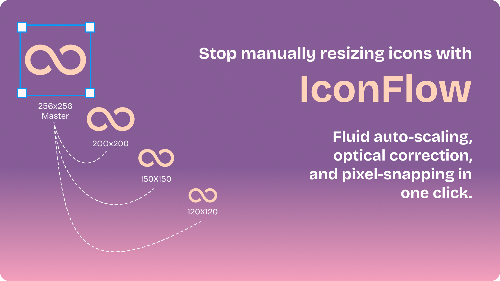

<div align="center">
  
  <h1>IconFlow for Figma</h1>
  <p><b>Resize and perfect your icons in one click.</b></p>
</div>


<video src="assets/demo.mp4" autoplay loop muted playsinline width="100%"></video>

IconFlow is an intelligent auto-scaling engine built for product designers and design system managers. Turn one master icon into a production-ready design system across multiple sizes and weights in seconds—complete with pixel-snapping and optical correction.

## ✨ Features
* **Master-First Workflow:** Create one core asset and let the plugin generate the rest.
* **Batch Processing:** Process massive batches of icons simultaneously.
* **Optical Correction:** Automatically boosts stroke weights slightly at sizes 16px and below to maintain perfect visual balance.
* **Pixel-Perfect Snapping:** Forces all coordinates to integers. Say goodbye to blurry sub-pixel rendering.
* **Production Outlines:** Safely flattens strokes into filled shapes for clean SVG handoff.
* **Auto-Layout Sets:** Automatically wraps generated icons into beautifully organized Figma Component Sets.

## 🛠️ Tech Stack
* **Figma Plugin API**
* **TypeScript**
* **HTML/CSS** (Custom UI with Bricolage Grotesque typography)

## 🚀 Local Installation (For Developers)
Want to run IconFlow locally or contribute?

1. Clone this repository:
   ```bash
   git clone [https://github.com/mokshhchughh/iconflow.git](https://github.com/mokshhchughh/iconflow.git)
